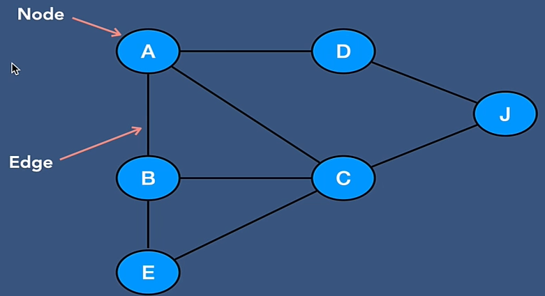
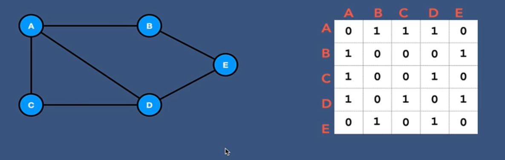

# Graph
Graph consists of finite set of vertices (nodes) and set of edges which connect a pair of nodes

## Types
- Unweighted graph: No weight associated with any edge
- Weighted graph: Weight associated with edges (weight can be negative)
- Undirected graph: No direction associated with any edge
- Directed graph: Direction associated with any edge
- Cyclic graph: Atleast one loop
- Tree: Special case directed acyclic graph

## Representation
### Adjacency Matrix
Square matrix with size of array = number of vertices

